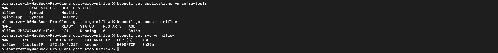
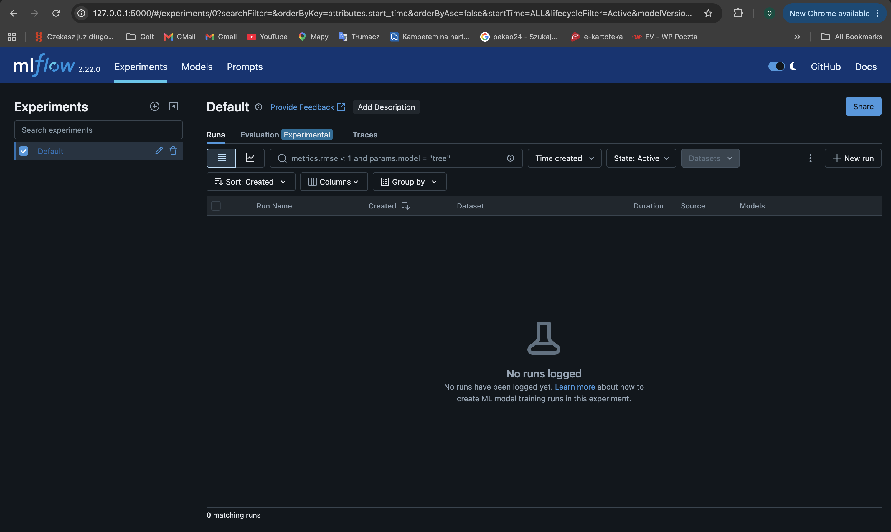
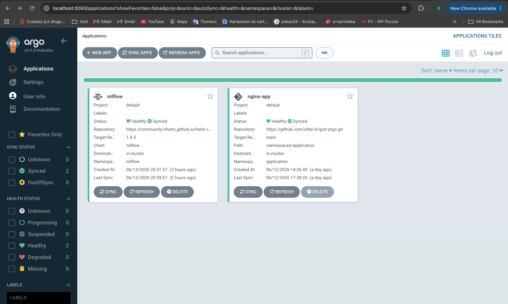

# MLflow Deployment with ArgoCD (GitOps)

Цей репозиторій містить конфігурацію GitOps-деплою застосунку MLflow за допомогою ArgoCD та Helm.

ArgoCD автоматично відстежує зміни в Git-репозиторії та синхронізує Kubernetes-кластер відповідно до принципів GitOps.

---

## Структура проєкту

```
goit-argo-mlflow/ 
├── application.yaml 
├── namespaces 
│ ├── infra-tools 
│ │ └── ns.yaml 
│ └── mlflow 
│ └── ns.yaml 
├── values 
│ └── mlflow-values.yaml 
└── README.md
```
* `application.yaml` — опис ресурсу **ArgoCD Application**, який визначає джерело Helm-чарту, налаштування синхронізації та цільовий namespace для деплою застосунку;
* `values/mlflow-values.yaml` — кастомні значення Helm-чарту MLflow, що містять конфігурацію ресурсів, сервісу та інших параметрів застосунку;
* `README.md` — інструкції щодо перевірки роботи застосунку та доступу до веб-інтерфейсу MLflow.

---

## Передумови
 
Перед початком роботи необхідно:

* мати розгорнутий EKS-кластер;
* встановити ArgoCD у namespace infra-tools;
* налаштувати kubectl для доступу до кластера.

Перевірити підключення до кластера можна за допомогою команд:

```bash
kubectl get nodes 
kubectl get pods -n infra-tools
```
---

## Розгортання MLflow через ArgoCD

### 1. Клонування репозиторію 

```bash
git clone https://github.com/olita16/goit-argo-mlflow.git 
cd goit-argo-mlflow
```

### 2. Створення ArgoCD Application 

Застосуйте конфігурацію ArgoCD Application:

```bash
kubectl apply -f application.yaml
```

### 3. Перевірка створення Application

Переконайтеся, що ArgoCD успішно створив застосунок:

```bash
kubectl get applications -n infra-tools
```

### 4. Перевірка створення Pod

Переконайтеся, що Pod застосунку успішно запущений:

```bash
kubectl get pods -n mlflow
```

### 5. Перевірка Service

Перевірте, що Kubernetes Service було створено:

```bash
kubectl get svc -n mlflow
```
---

Успішний run аплікаціі:



---


##  Доступ до MLflow UI

### 1. Для доступу до веб-інтерфейсу MLflow виконайте:


```bash
kubectl port-forward svc/mlflow -n mlflow 5000:5000
```
При успішному виконанні команди в терміналі буде відображено:

```
Forwarding from 127.0.0.1:5000 -> 5000
Forwarding from [::1]:5000 -> 5000
```

Після цього відкрийте у браузері:

http://127.0.0.1:5000

При успішному старті відкривається доступ до веб-інтерфейсу MLflow:



---

### Автоматична синхронізація GitOps

ArgoCD налаштовано з увімкненими параметрами автоматичної синхронізації:

```
syncPolicy: 
  automated: 
    prune: true 
    selfHeal: true 
  syncOptions: 
    - CreateNamespace=true

```
Це забезпечує:

*  автоматичне застосування змін після git push;
*  автоматичне виправлення відхилень від бажаного стану (self-heal);
*  автоматичне створення namespace за потреби.

---

### Перевірка GitOps-синхронізації

Після внесення змін у application.yaml або values/mlflow-values.yaml виконайте:

```bash
git add . 
git commit -m "Update MLflow configuration" 
git push origin main
```
ArgoCD автоматично виявить зміни та виконає синхронізацію.



Перевірити статус можна за допомогою команд:

```bash
kubectl get applications -n infra-tools 
kubectl get pods -n mlflow
```
---

### Використаний Helm-чарт

Для деплою застосунку використовується Helm-чарт MLflow:

*  Repository: https://community-charts.github.io/helm-charts
*  Chart: mlflow
*  Version: 1.8.5

Кастомні налаштування Helm-чарту знаходяться у файлі `values/mlflow-values.yaml`.

---

### Результат після успішного деплою:

- ArgoCD Application має статус Synced / Healthy;
- Pod MLflow перебуває у статусі Running;
- Kubernetes Service створено успішно;
- веб-інтерфейс MLflow доступний через kubectl port-forward;
- зміни автоматично застосовуються відповідно до принципів GitOps. 

---
